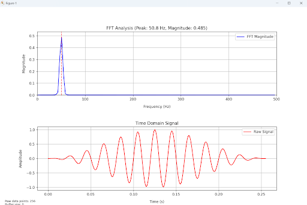
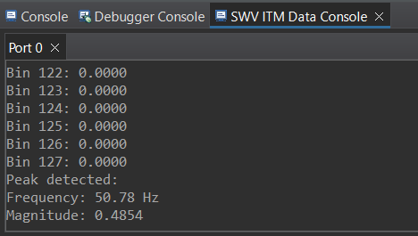

# 🔊 FFT Spectrum Analyzer

A real-time FFT Spectrum Analyzer using the STM32F446RE Nucleo board and a Python script for live polar visualization of spectral data.

---

## 🚀 Project Overview

This project performs a Fast Fourier Transform (FFT) on a simulated analog input (e.g., sine wave) using the STM32F446RE microcontroller and sends the spectrum data over UART. A companion Python script (`fft plot.py`) reads the data and displays it in real-time as a polar plot.

---

## 📁 Folder Structure

```
fft-spectrum-analyzer/
├── stm32-project/
│   ├── Core/                   # STM32 source files
│   ├── .ioc                    # STM32CubeMX configuration
│   └── ...                     # Startup, linker, etc.
├── fft plot.py                 # Python script for live FFT visualization
├── .gitignore
└── README.md
```

---

## 🛠 STM32 Side

### 🔧 Features
- Board: **STM32F446RE Nucleo**
- FFT Length: **256 points**
- Signal: Simulated **50 Hz sine wave** with Hanning window
- Output: FFT magnitude (scaled), printed to UART and ITM
- UART Baud: `921600` baud, 8-N-1
- LED toggle on each cycle (GPIOA PIN 5)

### 🧠 Core Functions
- `generate_test_signal()`: Generates and windows a sine wave
- `process_fft()`: Computes FFT with CMSIS-DSP
- `analyze_spectrum()`: Finds peak frequency
- `UART_SendString()`: Sends `RAW:<index>:<value>` format

---

## 🐍 Python Visualizer (`fft plot.py`)

### 📊 What it Does

- Connects to STM32 over `COM3` (115200 baud)
- Reads **32 float32 FFT magnitudes** (128 bytes), followed by a **4-byte sync marker**: `\xF9\xF8xN`
- Updates a **live polar bar chart** of the FFT spectrum

### ⚙️ Requirements

```bash
pip install matplotlib pyserial numpy
```

### ▶️ Run

```bash
python fft plot.py
```

To change COM port:
```bash
python fft plot.py --port COM6
```

## 🖼️ Example Python Output

Below is an example plot generated from the `fft plot.py` visualizer:



- Peak Frequency: ~50.8 Hz  
- Amplitude: ~0.485  
- FFT Length: 256 points  

---

## 🧪 STM32 ITM Console Output

Captured from SWV ITM Console in STM32CubeIDE:



- Detected Peak Frequency: **50.78 Hz**
- Peak Magnitude: **0.485**


## 🖧 Communication Settings

| Parameter | Value        |
|----------:|--------------|
| Baud Rate | 115200 or 921600 (match in both ends) |
| Data Bits | 8            |
| Stop Bits | 1            |
| Parity    | None         |
| Flow Ctrl | None         |

---

## 📄 License

This project is licensed under the **MIT License**.

---

## 👨‍💻 Author

Created by [@JoMaitreya](https://github.com/JoMaitreya)  
Feel free to reach out with suggestions or feedback.
---


